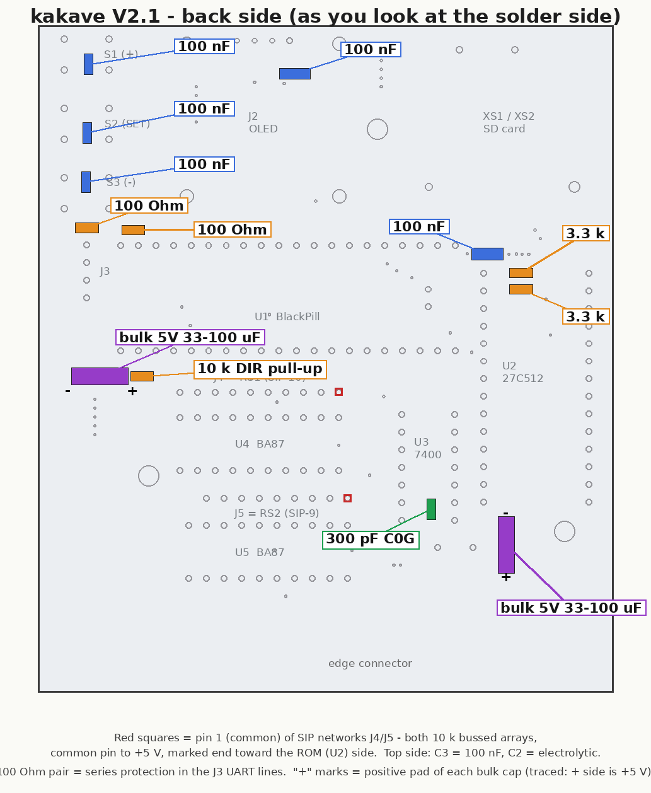

# Building the kakave V2.1 — what the gerbers don't tell you

Roadmap step 2 (floppy emulation) was resolved by fabricating the community's
board rather than designing a new one: **kakave V2.1**, built from the gerbers
in [ZPilot/kakave](https://github.com/ZPilot/kakave) `Community/`, is
**assembled and working on a real MS 0511** as of September 2026 — boots the
machine's own built-in МЗ driver from SD-card images, four drives, no software
modifications on the УКНЦ side.

This file records everything that had to be worked out to get there, because
none of it is written down upstream: the board ships as bare gerbers with **no
BOM, no schematic of its own, and no silk on the back side**, where most of
the passives live. Every value below was recovered by tracing the V2.1 copper
(pad → traces → vias → pins) and matching each part to its net in the original
kakave KiCad schematic — the circuit is unchanged between the original board
and the V2.x re-layouts, only the layout and reference designators moved.

## The board

~83 × 96 mm, two layers, МПИ edge fingers along the bottom. It plugs into the
УКНЦ and emulates the standard floppy controller at the register level
(177130/177132), so the stock boot menu and unmodified OS drivers just use it.
Design: Алексей Гуров & amigos de ZX-PK.RU; V2.x re-layout by Hanz45 /
@electroscatnes; GPL-3.0. Firmware and fab files all live in the upstream
repository.

## ICs, modules, connectors

| ref (V2.1) | part | notes |
|---|---|---|
| U1 | BlackPill STM32F401 module | on 2×20 headers; flash `firmware401/Release/f401test005.bin` |
| U2 | 27C512 EPROM | **not program storage — see below.** Any ≤100 ns part |
| U3 | 7400 | one TTL quad-NAND (К155ЛА3 works) |
| U4, U5 | КР580ВА87 | = Intel **8287** (inverting octal transceiver). Must be the inverting 8287/ВА87, **not** 8286/ВА86 |
| XS1 / XS2 | card socket — fit **one or the other** | XS2 = full-size SD, footprint is TE **2041021-1** exactly (DigiKey A108909-ND, Mouser 571-2041021-1; the part number needs its dash suffix or searches find nothing). XS1 = a nested microSD alternative: 9 pads at 1.1 mm pitch, two Ø1.0 locating pegs 8.0 mm apart, ~15.5 mm wide shell |
| J2 | SSD1306 OLED module, I²C, 4-pin | pin-outs vary between module vendors — check before soldering (upstream README warns the same) |
| J3 | 4-pin UART header | BlackPill A9/A10 through the two 100 Ω below |
| J4, J5 | **SIP resistor networks, not connectors** | see next section |
| S1–S3 | 6×6 mm tactile switches, 4-pin THT | the community case actuates them **through holes in the lid**, so use vertical long-stem parts (e.g. 6×6×13). The 6.5 × 4.5 mm hole grid also physically accepts the generic 4-pin right-angle type |

## The unlabeled back side

Viewed from the solder side:

| location | value | function (net it was traced to) |
|---|---|---|
| one 0805 behind each of S1/S2/S3 | 100 nF | button debounce to GND. V2.1 deleted the original's series 100 Ω — buttons run straight to the BlackPill |
| behind the OLED (J2) | 100 nF | OLED supply decoupling |
| pair beside J3 | 2 × 100 Ω | series protection in the UART lines; wire links are fine if the UART is never used |
| pair near U2's upper corner | 2 × 3.3 kΩ | pull-ups to +5 V on the EPROM select lines (`/SELECT1`, `/SELECT2`) |
| 1206 beside those | 100 nF | decoupling near U2 |
| single 0805 beside U3 | **300 pF, C0G/NP0** | timing cap on the 7400 one-shot. Its signal pad lands on **three** 7400 pins at once — the original `C1` net (pins 6+9+10) — which is how it was identified beyond doubt. Do not substitute 100 nF here |
| small 0805 beside the right-hand bulk cap | 10 kΩ | pull-up on `/VA87DIR` — the direction pin of **both** ВА87s. Keeps the transceivers off the bus while the STM32 boots. Not present in the original schematic; the re-layout added it so the board is safe even with the SIP networks unfitted |
| two large pad pairs, one at each +5 V entry of the edge connector | 2 × bulk electrolytic, 33–100 µF ≥10 V | polarity is unmarked; traced: near the 7400 the **+ pad is the one closer to the edge connector**; below J3 the **+ pad is the inner one** (the outer pad sits in the ground pour). Tantalums work — remember their stripe marks **positive**, opposite to aluminium cans |

Top side carries the only two labeled passives: **C3** (below the SD socket)
= 100 nF, **C2** (the oval by U3) = the second bulk electrolytic position on
some prints. Between V2.0 and V2.1 the C2/C3 names swapped and RS1/RS2 became
J4/J5 — don't mix documentation of the two revisions.

## J4/J5: the SIP networks

Despite the "J" designators these are the bus pull-up arrays (V2.0's silk
honestly calls them RS1/RS2): **bussed** 10 kΩ SIPs — J4 10-pin, J5 9-pin —
common pin to +5 V, one element per buffered AD line, plus J4's last element
on the ВА87 T/direction line. Bourns 4610X-101-103LF / 4609X-101-103LF, or
the generic parts marked **A103J**. Anything 4.7–10 k works; they only hold
tri-stated lines, no edges are shaped by them.

Two rules and one useful trick:

- **Bussed only.** An isolated-type array (marking not starting with A,
  Bourns "-102-") has the wrong internal wiring entirely.
- **Pin 1 (dot/stripe) toward U2/the ROM side** — that end is +5 V on both
  rows (traced). Shifted or reversed, the common lands on an AD line and
  everything degrades to 20 k line-to-line.
- **Only have 9-pin arrays?** Fit one in J4's holes 1–9, leaving hole 10
  empty: that covers all eight AD elements, and the discrete 10 k above
  covers the T line alone. This is exactly how the verified build was
  assembled. The discrete pull-up is then load-bearing — populate it.

## The "empty" EPROM that isn't

`27c512/controller.bin` upstream looks blank: 65 534 bytes of `0xFF` and two
odd bytes. It is correct as-is — **the 27C512 is an address decoder, not
program storage.** Its sixteen address pins read the buffered bus; two data
outputs feed the STM32 as select lines. The whole 64 KB is a lookup table
saying "not my register" everywhere except:

| offset | = address | byte | meaning |
|---|---|---|---|
| 0xFE58 | octal **177130** | 0xF7 | command/status register → `/SELECT1` low |
| 0xFE5A | octal **177132** | 0xEF | data register → `/SELECT2` low |

The EPROM decodes in tens of nanoseconds and its output edge interrupts the
STM32 (`//RSN o177130` in the firmware's interrupt handler) — that is how a
Cortex-M4 meets МПИ bus timing without decoding addresses in software. Burn
the file unmodified and verify; only those two bytes have to read back right.

Troubleshooting corollary: "УКНЦ hangs the moment anything touches 177130"
points at the EPROM, its socket, or its select wiring; "registers respond but
data is garbage" points at the ВА87s or the SD side.

## SD card and images

From the firmware source (FatFs `ffconf.h` and `ctrl128c.c`), not from docs:

- **FAT16/FAT32 only — exFAT is compiled out.** Cards over 32 GB ship exFAT;
  a ≤32 GB card formatted FAT32 is the friction-free path.
- **Root directory only.** The firmware enumerates `/` and skips folders.
  Long filenames work (255 chars, codepage 866, so Cyrillic names display).
- On boot it auto-mounts `DISKA.DSK` … `DISKD.DSK` as drives 0–3 if present;
  selections made with the buttons persist in an auto-created `kakave.cfg`
  (excluded from the image list — don't delete it).
- Images are **raw sector dumps, ukncbtl's `.dsk` format**, no header. Read
  offset = `((track×2)+head) × tracksize + (sector−1)×512`; 512-byte
  sectors, 10 per track, 2 heads. Recognized purely by file length:
  **819 200 bytes** = standard 80-cylinder 800 KB, **409 600** = 40-cylinder.
  An emulator-verified image is the right first boot test — any behavioural
  difference is then the board's fault, not the image's.
- A blank formattable disk is 819 200 zero bytes
  (`dd if=/dev/zero of=DISKB.DSK bs=512 count=1600`).

## Upstream quirks (so nobody debugs them as faults)

- ITO90.dsk games and ITO91's PacMan don't run — firmware limitation, noted
  in the upstream README.
- The **original** board's silk swaps the Left/Right button labels; V2.1
  relabels them +/SET/− and doesn't inherit this.
- The SET button sits close to the display — mount the OLED before the
  neighbouring switch if clearance looks tight.
- Writes are only guaranteed on standard-size images; test the write path on
  a scratch image before trusting it with anything archival.

## Method note

No schematic exists for V2.1 itself. The identifications above come from
parsing the gerber/drill files, building a copper connectivity graph (traces,
vias, pours) and walking each unlabeled pad to named pins, then matching the
resulting nets against the original schematic's netlist — plus one correction
supplied by the machine's builder (both 5 V bulk caps, where the first pass
had found one). The 300 pF cap and the SIP orientations were confirmed by
net topology, not position. The board then worked first try, which is the
only test that counts.
